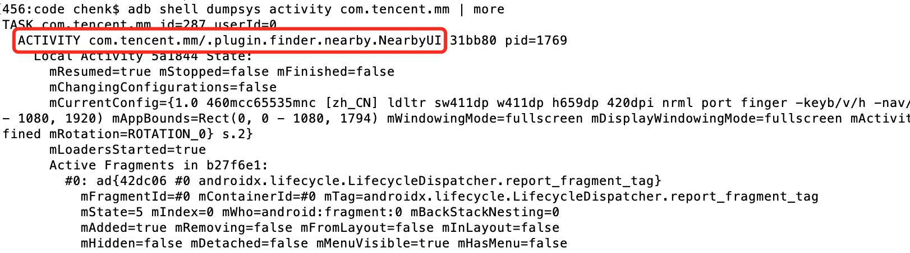
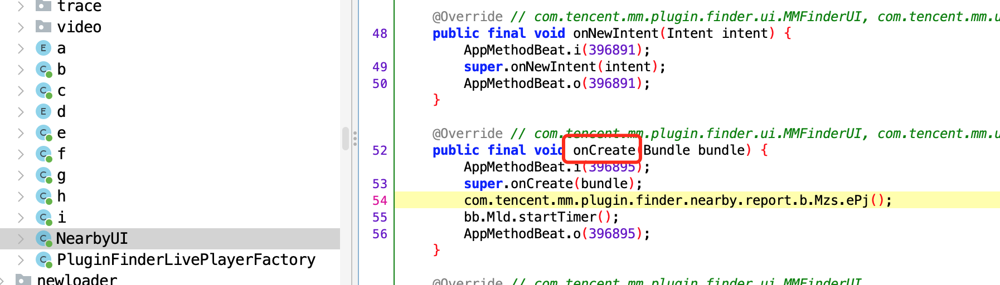
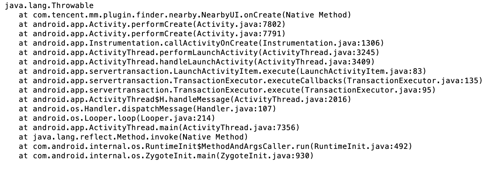
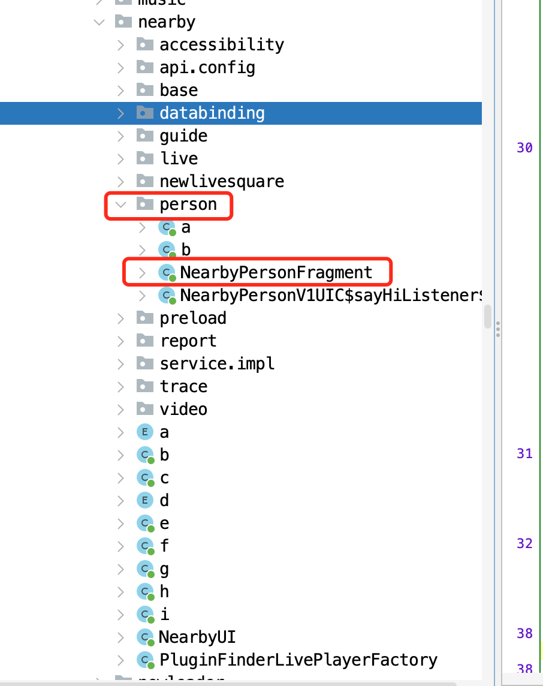
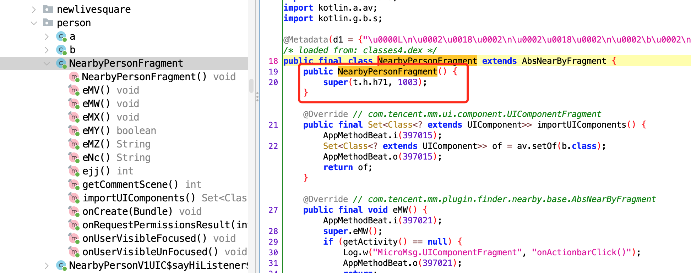
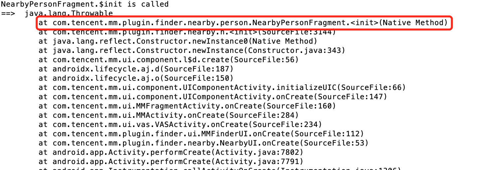
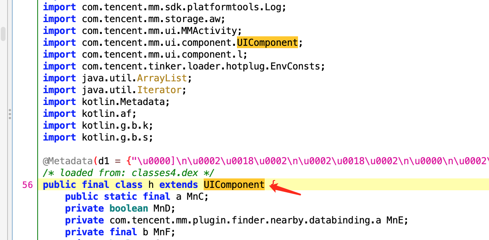
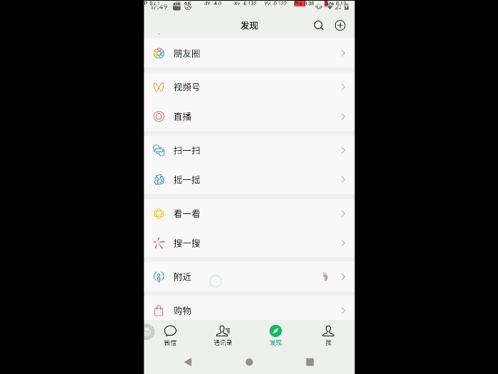
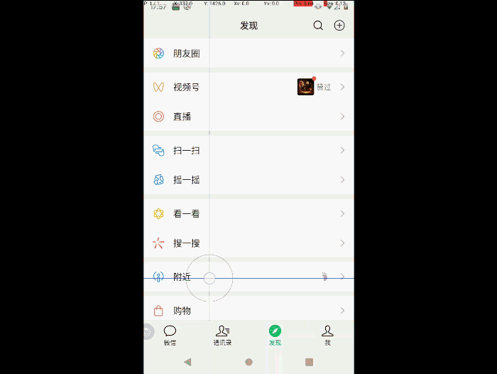

# 微信 安卓逆向 获取附近人数据一

## 点击 附近，直接跳转到附近人

### 前言
有段时间没玩附近人了，今天打开突然发现
界面那里多出了两个Fragment


今天想hook这段逻辑，要让这个直接跳转到附近人，而不是停留在同城直播

**开干！！！**

### 分析
- 1、这个界面应该是由一个Activity 和 多个 Fragment 组成的
- 2、附近人应该是其中一个Fragment
- 3、先找到创建Activity 或 Fragment 的call，再逐步分析

### 实操
- 查看当前页面的Activity
```bash
$ adb shell dumpsys activity com.tencent.mm | more
```



**红色框部分即是附近人的活动页面**

- 接下来，就是反编译源码（[jadx-gui](https://github.com/skylot/jadx.git)），并定位到该类


- hook onCreate函数，并打印出调用堆栈


并没发现什么有效信息，观察NearbyUI所在包附近的其他文件，发现有个疑似附近人的包



- hook构造函数，并打印堆栈，看看是否有被调用



**果然是有被调用的**



- 追溯到上一级调用
```bash
com.tencent.mm.plugin.finder.nearby.h.<init>
```

- 发现该类是继承 UIComponent 的


**那么他应该也有一个onCreate函数**
**跟进去分析发现，g.Mnx.eMR() 的返回值，会直接影响到进入默认的是哪个fragment**
**于是乎，这就容易了吧，直接修改 g.Mnx.eMR() 的返回值即可**

- frida js 代码如下
```javascript
let NearbyConfig = Java.use("com.tencent.mm.plugin.finder.nearby.g");
NearbyConfig["eMR"].implementation = function () {
    console.log(`NearbyConfig.eMR is called`);
    let result = this["eMR"]();
    console.log(`NearbyConfig.eMR result=${result}`);
    result = 1003
    return result;
};
```

### 接下来，看看效果

**修改前**


**修改后**